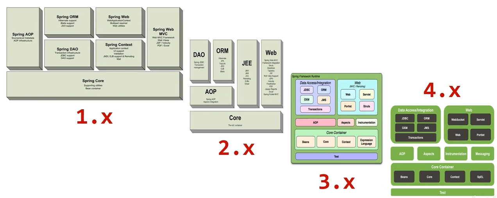

# Spring系统架构
Spring Framework：Spring生态圈中最基础的项目，是其他项目的根基。

1. Core Container（核心容器）：Spring框架中最核心的部分，容纳着对象，其它模块都依赖于它运行。
2. AOP（面向切面编程）：在不修改源代码的情况下实现程序动态统一地添加额外功能的一种技术。
3. Aspects（AOP思想的具体实现）
4. Data Access（数据访问）：与数据层相关的技术。
5. Data Integration（数据集成）：整合其它技术，结合使用。
6. Web：Web开发
7. Test：单元测试与集成测试